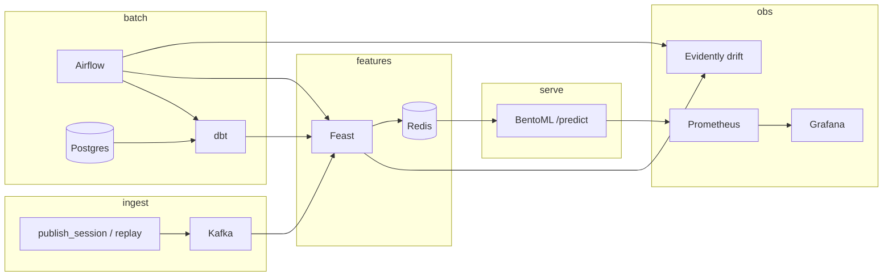

# ecommerce-conversion-pipeline

Real-time e-commerce conversion prediction demo: score the likelihood a shopper completes a purchase during an active session.

Built on the [Olist Brazilian E-Commerce](https://www.kaggle.com/datasets/olistbr/brazilian-ecommerce) dataset, replayed as a live event stream.

## Use case

When a shopper views a product, adds to cart, or reaches checkout:

1. Kafka ingests the event
2. A consumer writes **session** features to Redis through Feast `push`
3. BentoML joins those with **user / product / seller** features already materialized from the warehouse
4. `/predict` returns `conversion_probability`

**Label:** `purchased_within_session`.

## Stack

| Layer | Tool | Role |
|-------|------|------|
| Ingestion | Kafka (Redpanda) | `page_view`, `add_to_cart`, `checkout_start`, `purchase` |
| Warehouse | Postgres + dbt | Raw Olist/sessions → staging → feature marts |
| Orchestration | Airflow | Daily DAG: dbt → Feast → drift → train → validate |
| Features | Feast + Redis | Postgres offline + Redis online |
| Training | scikit-learn + MLflow | HistGradientBoosting → `models/` + `mlruns/` |
| Serving | BentoML | `/predict` from Feast online features + joblib model |
| Observability | Prometheus + Grafana | `/predict` request and response metrics |
| Data drift | Evidently | PSI vs last training reference (`models/drift_*`) |

## Architecture



**Two paths into Redis**

- **Batch** — dbt marts → Feast offline (Postgres) → `feast materialize` → user / product / seller (+ optional session snapshot)
- **Live** — Kafka `ecommerce.events` → `session_features` consumer → Feast `push` → session row overwritten in Redis

Training reads Feast historical features from Postgres (`staging.stg_sessions` spine). `--from-parquet` is a fallback only.

## Features

Same columns online and offline. User, seller, and 7-day product stats are point-in-time (no future leakage).

| Source | Features |
|--------|----------|
| Olist orders (batch) | `user_total_orders`, `user_avg_order_value` |
| Olist reviews (batch) | `seller_avg_review_score` |
| Reconstructed sessions (batch) | `product_conversion_rate_7d`, `product_view_count_7d` |
| Kafka (live) | `session_page_views`, `session_cart_value`, `minutes_since_last_event`, `checkout_started` |

Olist is order-level, not clickstream. `training/dataset.py` turns completed orders into converting sessions and reconstructs abandoned ones so both classes exist. Funnel snapshots (browse / cart / checkout) are sampled so a live session can be scored at any stage.

## Prerequisites

- Docker and Docker Compose
- Python 3.11+ and [uv](https://docs.astral.sh/uv/)
- [Kaggle CLI](https://github.com/Kaggle/kaggle-api) for Olist (`data/README.md`)

Default warehouse: user `conversion`, password `changethis`, database `conversion`, `localhost:5432`. Always use `uv run feast …` (a conda `feast` on `PATH` often lacks `psycopg`).

## 1. One-time setup

```bash
cp .env.example .env
mkdir -p airflow/logs && echo -e "AIRFLOW_UID=$(id -u)" >> .env
# Download Olist into data/raw/  — see data/README.md

docker compose up -d --build postgres redis kafka prometheus grafana \
  airflow-init airflow-webserver airflow-scheduler

uv sync
uv run pre-commit install
uv run python training/dataset.py
uv run python warehouse/load_raw.py
cd dbt && uv run dbt run --profiles-dir . && cd ..

cd feast/feature_repo
uv run feast apply
uv run feast materialize-incremental $(date -u +%Y-%m-%dT%H:%M:%S)
cd ../..

uv run python training/train.py
# optional: uv run python training/train.py --max-sessions 4000
```

If host port **6379** is taken, set `REDIS_PUBLISH_PORT=6380`. Feast on the host still expects Redis at `localhost:6379` (your existing Redis, or map 6379). If **8080** is taken, set `AIRFLOW_WEBSERVER_PORT` (this machine often uses **8081**). If **3000** is taken (common for Node), set `BENTOML_PORT=3003` in `.env` and use that port for serve, publish, and Prometheus.

## 2. End-to-end score (Kafka → Redis → BentoML → Grafana)

Leave the consumer running **before** you publish, or it will miss the events (unless you start a new consumer group with `auto_offset_reset=earliest`). Use the same `BENTOML_PORT` everywhere.

```bash
# Terminal B — Kafka → Feast push → Redis
uv run python streaming/consumer/session_features.py

# Terminal C — model server (0.0.0.0 so Prometheus in Docker can scrape /metrics)
uv run bentoml serve serving.service:ConversionService --host 0.0.0.0 --port "${BENTOML_PORT:-3000}"

# Terminal D — Kafka events, then HTTP /predict (Grafana only records this step)
uv run python streaming/publish_session.py
```

`publish_session.py` emits page_view / add_to_cart / checkout / purchase for the latest reconstructed session (`--session-id` to pick one), waits `--wait` seconds (default 2) for the consumer to push Redis, then POSTs `/predict` on `$BENTOML_PORT`. After the push, **`session_id` is enough** — BentoML reads customer / product / seller from Redis and joins materialized batch features.

`--no-predict` publishes Kafka only (Grafana will stay flat). Manual score:

```bash
curl -s "http://localhost:${BENTOML_PORT:-3000}/predict" \
  -H 'Content-Type: application/json' \
  -d '{"session_id":"<id printed by publish_session>"}'
```

To flood the topic instead of one session:

```bash
uv run python streaming/replay/replay_events.py --max-sessions 50
```

**Smoke test without Redis** (not the live path):

```bash
curl -s "http://localhost:${BENTOML_PORT:-3000}/predict" \
  -H 'Content-Type: application/json' \
  -d '{
    "session_id":"s-demo",
    "features":{
      "user_total_orders":2,
      "user_avg_order_value":89.5,
      "product_conversion_rate_7d":0.12,
      "product_view_count_7d":40,
      "seller_avg_review_score":4.2,
      "session_page_views":5,
      "session_cart_value":120.0,
      "minutes_since_last_event":1.5,
      "checkout_started":1
    }
  }'
```

BentoML docs: `http://localhost:$BENTOML_PORT`. Startup fails if `models/conversion_model.joblib` is missing.

## Observability

Grafana shows **serving API** traffic only. Kafka publish and Feast/Redis pushes do not appear on the dashboard.

```bash
docker compose up -d prometheus grafana
# BentoML must already be on 0.0.0.0:$BENTOML_PORT
# Generate points:  uv run python streaming/publish_session.py
```

| UI | URL | Login |
|----|-----|--------|
| Grafana | http://localhost:3002 | admin / admin — dashboard **Conversion serving API** |
| Prometheus | http://localhost:9090 | target `bentoml` must be **UP** |

Grafana is on **3002** so it does not collide with BentoML. If you change `BENTOML_PORT`, recreate Prometheus so the scrape target matches:

```bash
BENTOML_PORT=3003 docker compose up -d prometheus
```

Bind BentoML with `--host 0.0.0.0`. `127.0.0.1` is not reachable from Docker Desktop (`host.docker.internal`). Confirm scrape at http://localhost:9090/targets and raw series at `http://localhost:$BENTOML_PORT/metrics`.

| Series | Kind | Labels / meaning |
|--------|------|------------------|
| `conversion_predict_requests_total` | counter | `status` (`ok`/`error`), `source` (`feast_online`/`override`), `error` (`none`/`invalid`/`not_found`/`store`/`other`) |
| `conversion_predict_in_flight` | gauge | concurrent `/predict` calls |
| `conversion_predict_latency_seconds` | histogram | request latency |
| `conversion_predict_probability` | histogram | predicted score on successful responses |
| `conversion_predict_will_purchase_total` | counter | predicted class (`true`/`false`) |

Dashboard panels: request rate, error rate, in-flight, latency p50/p95/p99, requests by status and source, error types, probability, `will_purchase`, request totals.

## Data drift

[Evidently](https://docs.evidentlyai.com/) (PSI) compares **current** session features to a **reference** snapshot written at train time (`models/drift_reference.parquet`). Great Expectations is a better fit for schema checks; Evidently is the library for distribution shift.

```bash
# After a model exists: latest warehouse vs last training snapshot
uv run python monitoring/drift.py --from-warehouse

# No snapshot yet: older sessions vs the most recent 20% (time split)
uv run python monitoring/drift.py --from-warehouse --time-split
# or from parquet:
uv run python monitoring/drift.py --time-split
```

Writes `models/drift_metrics.json` and an HTML report `models/drift_report.html`. Dataset drift is true when the share of drifted columns ≥ `CONVERSION_MAX_DRIFT_SHARE` (default **0.5**). `--fail-on-drift` (or `CONVERSION_FAIL_ON_DRIFT=true`) exits non-zero so Airflow can block training.

## Local UIs

| UI | URL | Start |
|----|-----|--------|
| BentoML | http://localhost:3000 (`$BENTOML_PORT`) | step 2; `--host 0.0.0.0` |
| Grafana | http://localhost:3002 | compose `prometheus` + `grafana` |
| Prometheus | http://localhost:9090 | same; check **Status → Targets** |
| Airflow | http://localhost:8080 (or `$AIRFLOW_WEBSERVER_PORT`) admin / admin | compose in step 1 |
| Feast | http://localhost:8888 | below |
| MLflow | http://localhost:5001 | below |

```bash
cd feast/feature_repo
uv run --with grpcio --with grpcio-health-checking --with grpcio-reflection \
  feast ui --host 127.0.0.1 --port 8888

cd ../..
MLFLOW_ALLOW_FILE_STORE=true uv run --with 'anyio==4.9.0' \
  python -m mlflow ui --backend-store-uri ./mlruns --host 127.0.0.1 --port 5001
```

MLflow 3.x treats the file store as legacy, so `MLFLOW_ALLOW_FILE_STORE=true` is required. Port **5000** is often taken by macOS AirPlay.

## Airflow

DAG `conversion_batch_training` (`@daily`): dbt → `feast apply` + materialize → **Evidently drift** → `training/train.py` → fail if `test_roc_auc` &lt; `CONVERSION_MIN_TEST_ROC_AUC` (default **0.65**). Drift fails the DAG only when `CONVERSION_FAIL_ON_DRIFT=true`. Rebuild the Airflow image after adding `evidently` (`docker compose up -d --build airflow-scheduler airflow-webserver`).

Paused on first load. Unpause after the warehouse has been loaded once. Custom image: `infra/airflow/Dockerfile`. Project mount: `/opt/airflow/project`. Inside the containers Feast uses a runtime yaml so hosts are `postgres` / `redis`, not `localhost`.

| Variable | Purpose |
|----------|---------|
| `TRAIN_MAX_SESSIONS` | Limit DAG training rows (empty = full table) |
| `CONVERSION_MIN_TEST_ROC_AUC` | Promotion gate |
| `CONVERSION_MAX_DRIFT_SHARE` | Dataset-drift threshold (default 0.5) |
| `CONVERSION_FAIL_ON_DRIFT` | If true, drift task fails the DAG |
| `DRIFT_CURRENT_SESSIONS` | Limit rows for the drift current window |
| `AIRFLOW_WEBSERVER_PORT` | If 8080 is taken |
| `BENTOML_PORT` | Serve + `publish_session` + Prometheus scrape (default 3000) |
| `REDIS_PUBLISH_PORT` | Host publish for compose Redis if 6379 is taken |

`airflow-init` creates the `airflow` role/database if the Postgres volume predates that user.

## Tests

```bash
uv run pytest
```

Covers training, serving (including Prometheus `observe_request`), Feast definitions, the session aggregator, and Evidently drift. No Redis or BentoML required.

## Pre-commit

Hooks run on every `git commit`. Install once after `uv sync`:

```bash
uv run pre-commit install
uv run pre-commit run --all-files
```

| Hook | What it checks |
|------|----------------|
| **isort** | Import order (`profile = black`, line length 100) |
| **sqlfluff** | Lint + autofix Postgres / dbt SQL (jinja `ref` / `source`). Skips `dbt/macros/` |
| **bandit** | Python security scan (skips `tests/`) |
| **gitleaks** | Hardcoded secrets. Allowlists only the documented demo values `changethis` and the Airflow example Fernet key |

Config: `.pre-commit-config.yaml`, `.sqlfluff`, `.gitleaks.toml`, `[tool.isort]` / `[tool.bandit]` in `pyproject.toml`.

## Repository layout

```
.
├── compose.yml                 # Postgres, Redis, Kafka, Airflow, Prometheus, Grafana
├── .pre-commit-config.yaml     # isort, sqlfluff, bandit, gitleaks
├── airflow/dags/               # conversion_batch_training
├── warehouse/                  # Load Olist + sessions into raw
├── dbt/                        # Staging + feature marts
├── feast/feature_repo/         # Postgres offline, Redis online
├── infra/airflow/              # Airflow image (dbt, Feast, sklearn)
├── streaming/
│   ├── replay/replay_events.py
│   ├── publish_session.py      # One session → Kafka → /predict
│   └── consumer/session_features.py
├── training/                   # Sessions + HistGradientBoosting
├── monitoring/drift.py         # Evidently PSI vs training reference
├── serving/                    # BentoML ConversionService + Prometheus metrics
├── tests/
└── observability/
    ├── prometheus/prometheus.yml
    └── grafana/                # Provisioned serving dashboard
```

## Related repo

Companion fraud-detection demo: **ecommerce-fraud-pipeline** (checkout payment risk on IEEE-CIS data).

## License

MIT
